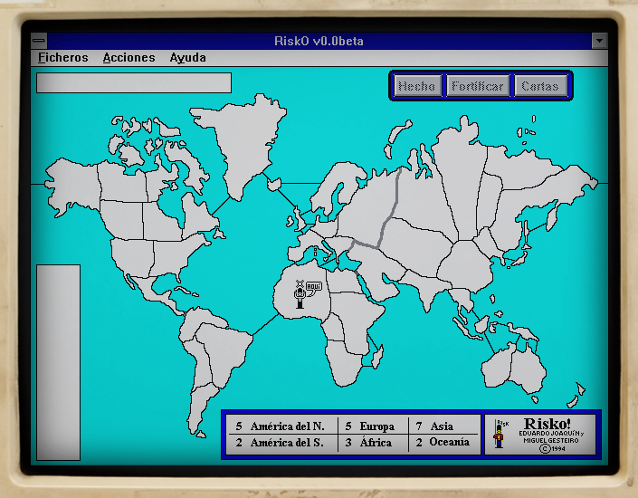

# RiskO
A Windows 3.x clone of the 80's Apple's Macintosh Systems:
[Risk game (1986 - by Tone Engel)](https://www.richardloxley.com/fun/risk/)

## Intro
It all began in 1992...

My friend Eduardo and I, while attending to the Telecommunications Engineering
School at the University of Vigo, hang a lot at the C.I.S. room, where all
those Macintosh (mostly Plus and SE) free to use were available.

We've never seen that kind of computers before, and got really hooked up,
specially to **that little jewell called "Risk"** on which we spent countless
hours 😇

And the summer came, and the University was closed. Back then, I got my 486 DX-33
PC clone, with DOS and Win 3.1, and both of us were already into programming so...
we talked about it and decided: "why don't we give it a try and program our
own clone for Windows (3.1)?"

And we did... oh yes, **we did!**

25 years later, the covid-19 came arround and during that time, many things
occurred, being one of them the **release of the source code** of our little
project, that we were so proud of.

So **here it is!**

You can **play it online** by clicking on the image above.

## Facts

* the game was initially called **Risk**, but for the *public release* we changed
it affraid of copyright laws: we used **risco** (=*risk* in Galician, our native language)
swapping the *c* for a *k*, and it became **RiskO!** (with the little nice extra of
expressing our admiration for the original game **Risk-Oh!**) 
* the game is in **Spanish** (sorry, we didn't know english back then)
* we were in our 20's 👶🏽👶🏻
* we programmed it in [Borland Pascal for Windows (7.0)](https://winworldpc.com/product/borland-pascal/7x)
(I can't recall exactly how we got our hands onto those floppies... probably at the university)
* we were doing pair programming - forcingly - because we have only one PC and
were two people 🤷‍♂️ (we didn't even know what
[pair-programming](https://en.wikipedia.org/wiki/Pair_programming) was 😅)
* we didn't have internet back then (not even modems were much available or affordable)
* no previous experience programming windows applications: we did it all with
only that software and the help files included within it, which were written for C... 🤦‍♂️
* we had no experience with graphics, computer *AI*, documentation or projects...
* we were, basically, pretty motivated ignorant believers, not really aware of
what we were heading into... 😂 I strongly believe that [ignorance was key](https://unquote.li/en/quotes/mark-twain/they-did-not-know-it-was-impossible-so-they-did-it-rn7w7zzyd4) to our success

Nevertheless, it was one of the best experiences of my life: doing something
you love with your best friend, while learning invaluable skills for the future.
Never went back! 😎🤩

## Resources

* Fan page by **Richard Oxley**: [Antonie "Tone" J. Engel's Risk](https://www.richardloxley.com/fun/risk/)
* You can play online to the original piece at [the Internet Archive](https://archive.org/details/mac_MacOS_7.0.1_compilation)
* Other Mac versions at [Macintosh Repository](https://www.macintoshrepository.org/2996-riskd)
* PC versions (about which I found out muuuuuch later):
  * [Risk](https://archive.org/details/win3_Risk3x), by **Azeroth, Inc.** for **Virgin** - 1991 (Win3.x) *(commercial)*
  * [Winrisk](https://archive.org/details/win3_winrisk), by **Steve Stancliff** - 1992 (Win3.x) *(freeware)*
  * [Risk](https://archive.org/details/Risk93_1020) [[alt](https://archive.org/details/win3_RISK100)], by **Peter Hjaeresen & Ole Hedegaard** - 1993 (Win3.x) *(shareware)*
  * [NCRisk](https://archive.org/details/WNCRISK), by **Neil Clasen** - 1996 (Win3.x) *(shareware)*
  * [RiskIt](https://archive.org/details/RiskIt_1020), by **Gottfried Nestyak** - 1996 (Win3.x) *(shareware - nagging)*
  * [Risk](https://archive.org/details/swizzle_demu_Risk), by **Anton Gustavsson** - 1997 (Win32) *(freeware)*
  * [TurboRisk](https://web.archive.org/web/20210731183142/https://www.marioferrari.org/freeware/turborisk/turborisk.html), by **Mario Ferrari** - 1999 (Win32),
    now in [Github](https://github.com/brian-scott-andrews/TurboRisk) (open-source)

## Contact
Please, feel free to reach us if you feel to it.

## LICENSE

This work is licensed under the [GNU General Public License v3.0](LICENSE-GPLV30). All media and data files that are not source code are licensed under the [Creative Commons Attribution 4.0 BY-SA license](LICENSE-CCBYSA40).

More information about licenses in [Opensource licenses](https://opensource.org/licenses/) and [Creative Commons licenses](https://creativecommons.org/licenses/).
